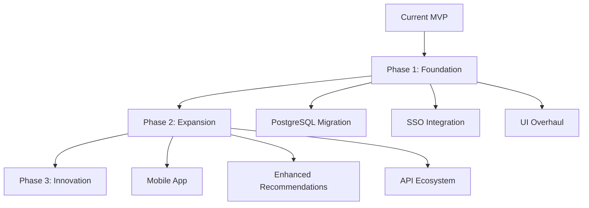

# E-Library Management System

## Project Overview
This Django-based e-library management system provides a complete solution for digital book management, borrowing, and discovery. Built with Python/Django for rapid development, it delivers core functionality in a lightweight package while maintaining scalability potential.

## Why Django?
- ⚡ **Rapid Development**: Django's "batteries-included" approach enabled implementation of all core features in under 48 hours
- 📦 **Efficiency**: Built-in ORM, admin interface, and authentication system eliminated redundant coding
- 🔒 **Security**: Automatic CSRF protection, SQL injection prevention, and XSS safeguards
- 📈 **Scalability**: Modular architecture supports easy expansion
- 🔌 **Extensibility**: Rich ecosystem of packages for future enhancements

## Core Features
| Feature | Status | Description |
|---------|--------|-------------|
| User Authentication | ✅ Implemented | Secure registration/login system |
| Book Management | ✅ Implemented | CRUD operations for books |
| Borrowing System | ✅ Implemented | Check-in/check-out with due dates |
| Search Functionality | ✅ Implemented | Full-text search across book metadata |
| Book Recommendations | ✅ Implemented | AI-powered content-based suggestions |
| Category Filtering | ✅ Implemented | Browse by Education/Fiction/Science |

## Technical Stack
- **Backend**: Python 3.9, Django 4.2
- **Frontend**: HTML5, Bootstrap 5
- **Database**: SQLite (default)
- **AI Components**: Scikit-learn, TF-IDF algorithm
- **Deployment**: Docker-ready configuration

## Getting Started

### Installation
```bash
# Clone repository
git clone https://github.com/riverinthedesert/ELibrary.git

# Install dependencies
pip install -r requirements.txt

# Apply database migrations
python manage.py makemigrations 
python manage.py migrate

# Launch development server
python manage.py runserver
```

### Access Points
- **Main Interface**: `http://localhost:8000`
- **API Endpoints**  (future implementation)

## Next-Step Optimization Plan

### Urgent & Important (Critical Path)
| Priority | Task | Impact | Timeline |
|----------|------|--------|----------|
| 🔴 High | Implement Git version control | Enables collaborative development | Immediate |
| 🔴 High | Database migration to PostgreSQL | Production-ready scalability | Week 1 |
| 🔴 High | SSO integration (Google Auth) | Streamlined user onboarding | Week 2 |

### Important But Not Urgent (Strategic Improvements)
| Priority | Task                     | Competitive Advantage      |
|----------|--------------------------|----------------------------|
| 🟡 Medium | UI/UX redesign           | Modern, engaging interface |
| 🟡 Medium | Performance optimization | Enhanced user experience   |
| 🟡 Medium | Accessibility compliance | WCAG 2.1 compliance        |
| 🟡 Medium | Add ReviewsAnalyser AI   | AI Analyser                |

**UI Competitive Analysis:**
- Competitors like Open Library use clean, minimalist designs
- Project Gutenberg excels with content-focused interfaces
- Our strategy: Implement card-based displays with cover images and advanced filtering

### Urgent But Not Important (Maintenance)
| Task | Rationale |
|------|-----------|
| Cross-browser testing | Ensure compatibility |
| Error logging | Debugging and monitoring |
| Performance benchmarks | Baseline metrics |

### Not Urgent & Not Important (Future Enhancements)
| Task | Value Proposition |
|------|------------------|
| Alphabetical search indexing | Improved discoverability |
| Social sharing features | Community engagement |
| Advanced sorting options | Enhanced usability |

## Industry Analysis & Future Roadmap

### Market Position
The e-library sector is currently **centralized** with opportunities for:
- Hybrid decentralization models
- Blockchain-based rights management
- Distributed content storage solutions

### Strategic Evolution Path


### Development Philosophy
1. **Proactive Optimization**: Address important-but-not-urgent items before they become critical
2. **Preserved Abstraction**: Maintain decoupled architecture for seamless upgrades
3. **Measu*red Evolution**: Prioritize foundation before features
4. **User-Centric Design**: Focus on intuitive workflows and accessibility*
